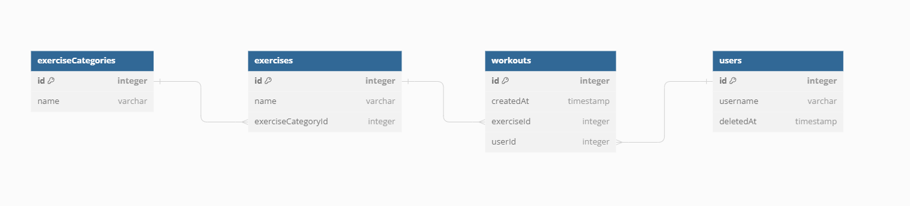

# JtcnwGymApp

## Abstract
&emsp; Hi everyone, nice to see you here! You might be wondering about this "Pasta Code" application. If not, no worries! I'll give you a brief overview.
  
&emsp; JTCNW loosely translates to "Ignore those who didn't believe" (in polite terms). This motto is something I use in the gym, but it can be applied to any aspect of our lives. This application revolves around this motto, with our vision being: "Forget those who didn't believe" - JTCNW.
  
&emsp;
Now, let's talk about the purpose of this application. I'm creating it for three reasons:
 a) This is my engineering project. Period.
 b) I have a strong interest in sports, specifically in gym training. Period.
 c) I noticed that most training apps are designed for mobile, and there aren't many good web-based options. I'm here to change that. (You might find some better web training apps, but don't let that deter me.)
  
&emsp;
We have a vision and purpose, so let's talk about the technologies I'll be using. The backend will be developed in .NET 8, the frontend in React (specific version to be decided), and the database will be PostgreSQL.
  
&emsp;
To sum up, I'm working on creating a web application for tracking gym workouts using .NET and React. ***This is where the journey begins.***

## Database structure

